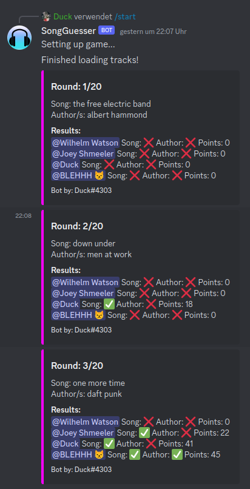

# Discord-Song-Guesser

- [What is this repo for](#what-is-this-repo-for)
- [Bot Slash-Commands](#bot-slash-commands)
- [Getting started](#getting-started)
- [Minimum permission requirements for the bot](#minimum-permission-requirements-for-the-bot)

## [What is this repo for](#what-is-this-repo-for)

This repository hosts a Discord song guesser bot designed to engage you and your friends in an entertaining song guessing game. When activated, the bot plays a snippet of a track lasting 30 seconds, challenging participants to swiftly identify the song title and at least one of its authors or artists. The quicker you make an accurate guess, the higher the points you stand to earn, adding an exciting element of speed and knowledge to the gameplay.

## [Bot Slash-Commands](#bot-slash-commands)

|command|description|
|---|---|
|start|Start a game by providing a link to a spotify playlist or multiple playlists seperated by `,` and amount of rounds|
|cancel|Cancel game|

## [Getting started](#getting-started)

---
Running in docker:

1. Create you your first bot on [discord-developer-portal](https://discord.com/developers/applications)
2. Set up your bot and save your bot token since you are able to see it only one time at creation. If you haven't done that you can still reset the token and get a new one.
3. Enable the `SERVER MEMBERS INTENT`  and `MESSAGE CONTENT INTENT` for your bot.
4. Create you on app on [developer.spotify.com](https://developer.spotify.com/dashboard) and follow [this](https://developer.spotify.com/documentation/web-api/tutorials/getting-started#create-an-app) steps to get you Client_ID and Client Secret
5. Open the `.env` file and add your discord bot token, client id and client sec to the environment-variables.
6. Now you are pretty much done and you can start your application. You can do that by starting the docker container `$ docker-compose up`.

---
Running in code:

1. Create you your first bot on [discord-developer-portal](https://discord.com/developers/applications)
2. Set up your bot and save your bot token since you are able to see it only one time at creation. If you haven't done that you can still reset the token and get a new one.
3. Enable the `PRESENCE INTENT`, `SERVER MEMBERS INTENT`  and `MESSAGE CONTENT INTENT` for your bot.
4. Create you on app on [developer.spotify.com](https://developer.spotify.com/dashboard) and follow [this](https://developer.spotify.com/documentation/web-api/tutorials/getting-started#create-an-app) steps to get you Client_ID and Client Secret
5. Define these vm-argument for your bot `-DBotToken=CHANGE_ME -DSpotifyClientId=CHANGE_ME -DSpotifyClientSecret=CHANGE_ME -DGamesConfig=./GamesConfig.json -DReplacementFile=./replacements.txt`
6. Start your code.

---

## Nice to know

- To earn points, you have to guess at least 60% of the song title
- If you guessed 40% of the track or too much, it notifies you that you are close
- The bot replaces every whitespace in the user message and song title to prevent human errors
- You have to guess the exact name of the artist. For example, "p!nk" is the only right answer, and not "pink"
- The bot replaces every word of a song title that is contained in the `replacements.txt`, so players don't have to guess the title extension, like For example "radio mix"
- Every player has to send their guesses to the bot via direct message

## [Minimum permission requirements for the bot](#minimum-permission-requirements-for-the-bot)

Permisson integer: `1084516464704`
